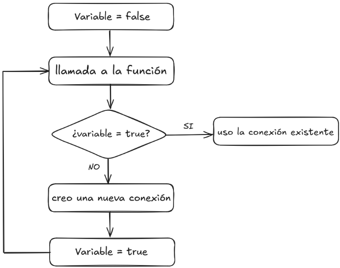

# Proyecto Gestion De Biblioteca
Repositorio de metodologia de sistemas

- Jeronimo Baltian Ortiz
- Jimena Martinez Arana
- Carlos Alberto Arce
- Marcos Diaz

---
## Indice

- [Propuesta](#proyecto-propuesto)
- [Patron Creacional](#patrón-creacional)
- [Singleton](#singleton)
- [Decorator](#patron-decorator)
- [Builder](#patrón-builder)
- [Factory](#patron-factory)

---
## Proyecto propuesto

El proyecto del Grupo 6, para su aplicación a la materia Metodología de Sistemas II, es un Sistema de Sestión de Bibliotecas, con un servicio online accesible por medio de un navegador web. Las herramientas y la arquitectura de su diseño son un Backend donde se emplean Node.js, Express y mongoDB para servir los datos, con un concepto de servicio exclusivamente de tipo API, mas un Frontend diseñado en React.js, en ambos casos con el lenguaje javascript.

El Backend es una API que permite operar a través de endpoints, los cuales brindan servicios para crear, leer, actualizar  y eliminar los documentos almacenados en la base de datos. La base de datos almacena dos colecciones, libros y contenido y el diseño del backend sigue un patrón de diseño estándar: modelo, servicio, controlador, rutas y aplicación.

El Frontend es un diseño para el consumo de esa API, producido con React.js, basado en el uso de componentes reutilizables, el uso de un DOM virtual para las actualizaciones, la sintaxis JSX para integrar HTML y JavaScript y la capacidad de crear interfaces dinámicas y responsivas.
- [~volver al indice~](#indice)

---
## Patrón creacional

Los patrones creacionales son técnicas de diseño de software directamente relacionadas con la creación de objetos o, lo que es lo mismo, con la creación de instancias de una clase.

Su razón de ser es la de abstraer la creación de la instancia, a fin de evitar la dependencia de la forma en que se crea la instancia. Los patrones pueden verse como un diseño que evita que el código cliente quede fuertemente acoplado a la forma exacta en que los objetos son creados, o sea: que el resto del código no dependa de como se crea el objeto o que tenga que indicar como crearlo.

- [~volver al indice~](#indice)

---
## Patrón Singleton

El Singleton se utiliza cuando se desea que una clase produzca una única instancia en todo el sistema, o sea: cuando se quiere un único objeto de esa clase, pero todos los módulos deben poder acceder al mismo.

Un ejemplo sencillo de patrón singleton es el del personaje de Super Mario en el juego homónimo, donde solo puede existir una instancia del mismo a lo largo de la ejecución del juego; en otras palabras: no pueden existir dos Super Marios.

Las carácterísticas del patrón singleton son:

- El objeto creado es la única instancia de la clase.
- La instancia es de carácter global, todos pueden acceder a la misma.
- Existe un único punto de configuración de la instancia en el programa.

## Singleton en el proyecto de Grupo

Nuestro proyecto es un sistema web de gestión de biblioteca desarrollado en javascript, con una API en el backend y un frontend diseñado en React, el cual consume esa API. La base de datos es MongoDB y la librería es mongoose.

La conexión a la base de datos es una situación ideal para aplicar **un diseño** de patrón singleton, dado que la conexión a una base de datos tiene necesariamente que ser una instancia única, que se comparte con cualquier otro sector del sistema y su configuración se centraliza en un único punto.

Mongoose tiene la característica de no permitir que la conexión pueda duplicarse y de emplear siempre la misma, pero esa no es la cuestión; la cuestión es si la conexión **está diseñada** bajo un patrón singleton, esto es: si sacamos a mongoose, ¿la conexión se instancia con cada llamada a la base de datos o su diseño lo impide?

Por todo lo anterior, la conexión a una base de datos es un lugar perfecto para aplicar el patrón singleton en nuestro proyecto, con un diseño que en vez de crear la conexión ante la llamada, primero verifique si hay una conexión ya instanciada.

## Diseño Singleton en nuestra conexión

El proceso de conexión y la aplicación del patrón singleton es:

1.	Se crea una variable booleana y se la declara false.
2.	Se inicia la función de conexión.
3.	Si la variable booleana es true, se retorna la conexión que debería existir.
4.	Sabemos que es falsa, por ser la primera oportunidad que se intenta la conexión.
5.	Se inicia un algoritmo try/catch para crear la conexión y atender los errores.
6.	Se crea una constante con los valores para acceder a la base de datos.
7.	Si no se puede acceder, se lanza un error y se detiene la ejecución.
8.	Si se puede acceder, se crea la conexión.
9.	Se declara a la variable booleana inicial como verdadera, fin del try.
10.	El catch se ocupa de la posibilidad de error.
11.	Se exporta la conexión.
12.	La siguiente llamada encontrará que la variable booleana es true.
13.	Esa llamada entonces, recibirá la conexión existente.
14.	Por lo mismo, se detendrá el proceso y no se creará una nueva conexión.

## Diagrama de la Conexión Singleton a la BDD (png)

Este diagrama muestra cómo funciona el patrón **Singleton** aplicado a la conexión con MongoDB:  
- Si ya existe una conexión abierta, se reutiliza.  
- Si no, se crea una nueva y se marca como activa.  



- [~volver al indice~](#indice)

---
## Patrón Decorator

El patrón Decorator se utiliza para añadir nuevas funcionalidades o responsabilidades a un objeto de forma dinámica, sin necesidad de modificar su clase original. Funciona "envolviendo" el objeto base con uno o más objetos "decoradores" que añaden el nuevo comportamiento.

Un ejemplo clásico es el de una cafetería: el objeto base es un "Café solo". A este se le pueden añadir decoradores como "Leche", "Azúcar" o "Crema". Cada decorador añade un costo y una descripción, pero el objeto final sigue siendo un tipo de café. No es necesario crear una clase para cada posible combinación de ingredientes.

Las características del patrón Decorator son:

Permite añadir o quitar responsabilidades de un objeto en tiempo de ejecución.

Es una alternativa flexible a la herencia para extender la funcionalidad.

Los decoradores tienen la misma interfaz que el objeto que envuelven.

Se pueden anidar múltiples decoradores para combinar funcionalidades complejas.

Decorator en nuestro proyecto

Nuestro proyecto de gestión de biblioteca necesita enriquecer los datos de los libros antes de enviarlos como respuesta en la API. El modelo base de Libro contiene la información esencial, pero para el cliente (frontend) necesitamos datos adicionales o procesados.

El patrón Decorator se aplica para añadir esta información de forma limpia y modular. Hemos implementado tres decoradores específicos:

PortadaDecorator: Transforma la ruta relativa de la imagen de portada (ej: /uploads/imagen.jpg) en una URL completa y accesible (ej: http://localhost:3000/uploads/imagen.jpg), utilizando el contexto de la petición (req).

DisponibilidadDecorator: Añade un campo para indicar si el libro está disponible para préstamo.

StatsDecorator: Agrega estadísticas relevantes, como el rating o el número de veces que ha sido prestado.

Este enfoque mantiene nuestro modelo de datos principal (Libro) limpio, mientras que la lógica para enriquecer la respuesta queda encapsulada en los controladores y las clases decoradoras.

Diseño Decorator en nuestro sistema
El proceso de aplicación del patrón Decorator se puede ver claramente en los métodos getLibros y getLibroById del controlador. El flujo es el siguiente:

1. El controlador recibe una petición (req) para obtener uno o más libros.

2. Se llama a un servicio (libroServicio) que obtiene los datos crudos del libro o libros desde la base de datos.

3. Si es una lista de libros, se utiliza el método .map() para aplicar el proceso de decoración a cada libro individualmente.

4. Comienza la cadena de decoración para un libro: primero se instancia PortadaDecorator, pasándole el objeto del libro y el objeto req para construir la URL completa de la imagen.

5. Luego, se toma el objeto resultante del primer decorador (usando decorado.getData()) y se pasa al constructor del DisponibilidadDecorator.

6. De la misma forma, el resultado del segundo decorador se pasa al constructor del StatsDecorator.

7. Finalmente, se llama al método getData() del último decorador en la cadena para obtener el objeto final, completamente enriquecido con todas las nuevas propiedades.

8. Este objeto final es el que se incluye en la respuesta JSON de la API.

9. Este método nos permite componer dinámicamente el objeto de respuesta, añadiendo solo la información necesaria de una manera ordenada y mantenible.

- [~volver al indice~](#indice)

---
## Patrón Builder

###  Builder para el modelo Libro

El modelo `Libro` tiene muchos atributos, algunos opcionales, otros condicionales según el tipo, el año, etc. Instanciar un libro correctamente puede ser poco legible y propenso a errores si se usa un constructor con muchos parámetros o un objeto literal gigante.

En el proyecto, el Builder se puede usar para:
- Crear objetos Libro de manera más clara.
- Manejar fácilmente atributos opcionales (por ejemplo, ISSN solo para revistas, ISBN solo para libros de cierto año, etc).
- Validar atributos antes de construir el objeto final, evitando errores en la base de datos.

El patrón **Builder** permite construir objetos complejos paso a paso, separando:
- **La lógica de construcción** (qué partes se agregan y en qué orden).
- **Del objeto final** que se obtiene.

Así, el mismo proceso de construcción puede generar diferentes representaciones del objeto, y el código resulta más legible y mantenible.

---

## Ventajas del patrón Builder

- Permite manejar objetos con muchos parámetros opcionales o condicionales.
- Hace que el código sea más legible que un constructor gigante.
- Permite crear diferentes configuraciones de un objeto sin duplicar código.
- Separa la lógica de construcción de la lógica de negocio.

## Desventajas

- Introduce más clases (el Builder y a veces un Director).
- Puede ser más complejo de lo necesario para objetos simples.

---

## Ejemplo aplicado al modelo Libro

Supongamos que queremos crear un libro usando Builder en JavaScript:

```js
class LibroBuilder {
    constructor() {
        this.libro = {};
    }

    setTipo(tipo) {
        this.libro.tipo = tipo;
        return this;
    }

    setISBN(isbn) {
        this.libro.isbn = isbn;
        return this;
    }

    setISSN(issn) {
        this.libro.issn = issn;
        return this;
    }

    setTitulo(titulo) {
        this.libro.tituloLibro = titulo;
        return this;
    }

    setAutor(autor) {
        this.libro.autor = autor;
        return this;
    }

    setIdioma(idioma) {
        this.libro.idioma = idioma;
        return this;
    }

    setEditorial(editorial) {
        this.libro.editorial = editorial;
        return this;
    }

    setMedidas(medidas) {
        this.libro.medidas = medidas;
        return this;
    }

    setGenero(genero) {
        this.libro.genero = genero;
        return this;
    }

    setSubgenero(subgenero) {
        this.libro.subgenero = subgenero;
        return this;
    }

    setMes(mes) {
        this.libro.mes = mes;
        return this;
    }

    setAnio(anio) {
        this.libro.anio = anio;
        return this;
    }

    setPaginas(paginas) {
        this.libro.paginas = paginas;
        return this;
    }

    setPortadaImagePath(path) {
        this.libro.portadaImagePath = path;
        return this;
    }

    build() {
        // se puede agregar validaciones extra 
        return this.libro;
    }
}

// USO:
const libro = new LibroBuilder()
    .setTipo('Libro')
    .setISBN('978-3-16-148410-0')
    .setTitulo('El Principito')
    .setAutor('Antoine de Saint-Exupéry')
    .setIdioma('Español')
    .setEditorial('Editorial Ejemplo')
    .setMedidas('22.5 x 12.8')
    .setGenero('Novela')
    .setSubgenero('Infantil')
    .setAnio(1943)
    .setPaginas(96)
    .build();
```

- [~volver al indice~](#indice)

---
## Patrón Factory
El patrón Factory es un patrón de diseño creacional el cual se usa para crear objetos sin que el código cliente sepa que clase o tipo de objeto se esta instanciando.

### Características:
- Facilitar la extensión: si se quiere añadir una nueva clase, hay que nada mas expandir el Factory, dando la posibilidad de evitar romper el código cliente.
- Encapsulamiento de la creación de objetos: se evita que el cliente use el "new".
- Mejor abstracción: el cliente trabaja con una interfaz común.
---
## Implementación del patrón Factory en el Frontend

En nuestro frontend implementariamos el patrón Factory por varias razones:
- Desacoplamiento: el cliente no tiene que saber como se crean los componentes, solo nos tiene que pedir que objeto quiere ver.
  Sin el Factory tendriamos que decidir que renderizar (tarjeta del autor, del libro o de la revista), pero al implementarlo tenemos que nada mas llamar al factory y la lógica estaria encapsulada.
- Escalabilidad y mantenimiento: en caso futuro de añadir una clase o modificar algo de otras, solo tendriamos que ir al Factory y no ir cambiando todos los archivos en los que usamos cada clase.
- Manejo de varios objetos: en nuestro caso usamos libros, revistas y autores. Cada uno requiere un componente distinto en sus interfaces (libro tiene el ISBN, revista tiene numero de edición e ISSN y el autor tiene la biografía).
  Al usar Factory ponemos todo en un solo lugar y nos evitamos el trabajo de usar miles de Ifs o Switchs que están repartidos por todos los archivos.

### Abreviando todo sobre Factory:
El usar Factory nos va a facilitar el mantenimiento, la escalabilidad y la organización en nuestra aplicación de gestión de biblioteca, evitando repetir código, tener código limpio y facilitando la incorporación de nuevas entidades en planes futuros

- [~volver al indice~](#indice)
