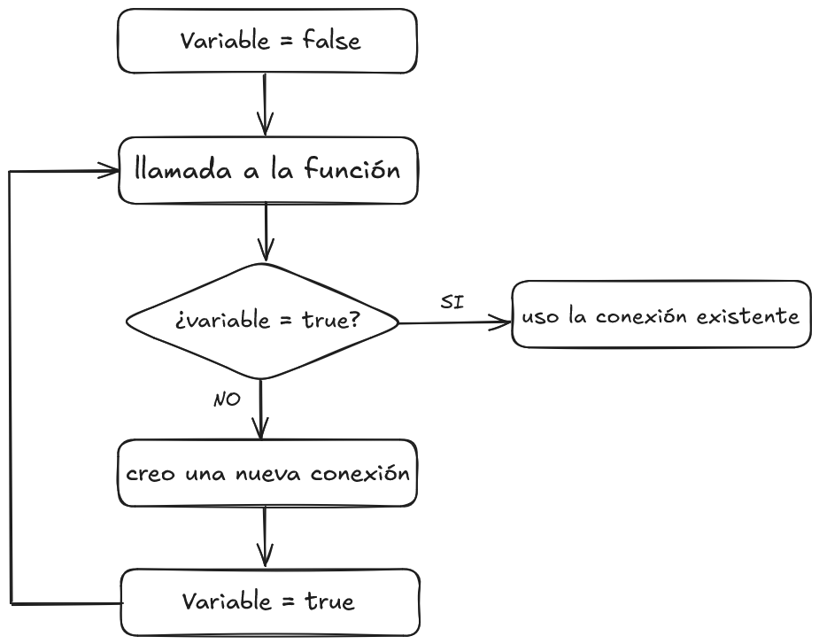

### Patrón creacional

Los patrones creacionales son técnicas de diseño de software directamente relacionadas con la creación de objetos o, lo que es lo mismo, con la creación de instancias de una clase.

Su razón de ser es la de abstraer la creación de la instancia, a fin de evitar la dependencia de la forma en que se crea la instancia. Los patrones pueden verse como un diseño que evita que el código cliente quede fuertemente acoplado a la forma exacta en que los objetos son creados, o sea: que el resto del código no dependa de como se crea el objeto o que tenga que indicar como crearlo.

### Singleton

El Singleton se utiliza cuando se desea que una clase produzca una única instancia en todo el sistema, o sea: cuando se quiere un único objeto de esa clase, pero todos los módulos deben poder acceder al mismo.

Un ejemplo sencillo de patrón singleton es el del personaje de Super Mario en el juego homónimo, donde solo puede existir una instancia del mismo a lo largo de la ejecución del juego; en otras palabras: no pueden existir dos Super Marios.

Las carácterísticas del patrón singleton son:

- El objeto creado es la única instancia de la clase.
- La instancia es de carácter global, todos pueden acceder a la misma.
- Existe un único punto de configuración de la instancia en el programa.

### Singleton en el proyecto de Grupo

En nuestro proyecto, un sistema web de gestión de biblioteca desarrollado en javascript, con una API en el backend y un frontend diseñado en React, el cual consume esa API. La base de datos es MongoDB y la librería es mongoose.

La conexión a la base de datos es una situación ideal para aplicar **un diseño** de patrón singleton, dado que la conexión a una base de datos tiene necesarianente que ser una instancia única, que se comprarte para cualquier lado del sistema y su configuración se centraliza en un único punto.

Mongoose tiene la característica de no permitir que la conexión pueda duplicarse y de emplear siempre la misma, pero esa no es la cuestión; la cuestión es si la conexión **está diseñada** bajo un patrón singleton, esto es: si sacamos a mongoose, ¿la conexión se instancia con cada llamada a la base de datos o su diseño lo impide?

Por todo lo anterior, la conexión a una base de datos es un lugar perfecto para aplicar el patrón singleton en nuestro proyecto, con un diseño que en vez de crear la conexión ante la llamada, primero verifique si hay una conexión ya instanciada.

### Diseño Singleton en nuestra conexión

El proceso de conexión y la aplicación del patrón singleton es:

1.	Se crea una variable booleana y se la declara false.
2.	Se inicia la función de conexión.
3.	Si la variable booleana es true, se retorna la conexión que debería existir.
4.	Sabemos que es falsa, por ser la primera oportunidad que se intenta la conexión.
5.	Se inicia un algoritmo try/catch para crear la conexión y atender los errores.
6.	Se crea una constante con los valores para acceder a la base de datos.
7.	Si no se puede acceder, se lanza un error y se detiene la ejecución.
8.	Si se puede acceder, se crea la conexión.
9.	Se declara a la variable booleana inicial como verdadera, fin del try.
10.	El catch se ocupa de la posibilidad de error.
11.	Se exporta la conexión.
12.	La siguiente llamada encontrará que la variable booleana es true.
13.	Esa llamada entonces, recibirá la conexión existente.
14.	Por lo mismo, se detendrá el proceso y no se creará una nueva conexión.

### Diagrama de la Conexión Singleton a la BDD (png)



### Diagrama de la Conexión Singleton a la BDD (mermaid)

Este diagrama muestra cómo funciona el patrón **Singleton** aplicado a la conexión con MongoDB:  
- Si ya existe una conexión abierta, se reutiliza.  
- Si no, se crea una nueva y se marca como activa.  


```mermaid
flowchart TD
    A[Variable = false] --> B[Llamada a la función connectDB()]
    B --> C{¿isconnected = true?}
    C -- SI --> D[Uso la conexión existente]
    C -- NO --> E[Creo una nueva conexión con MongoDB]
    E --> F[isconnected = true]
    F --> B
```
